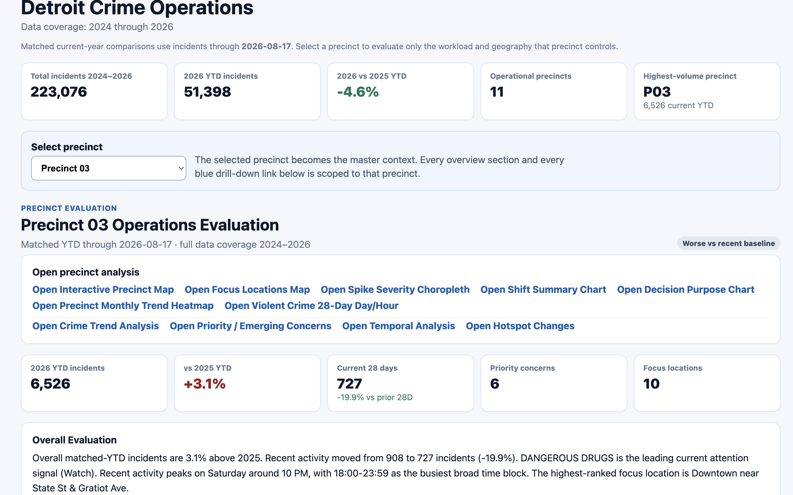
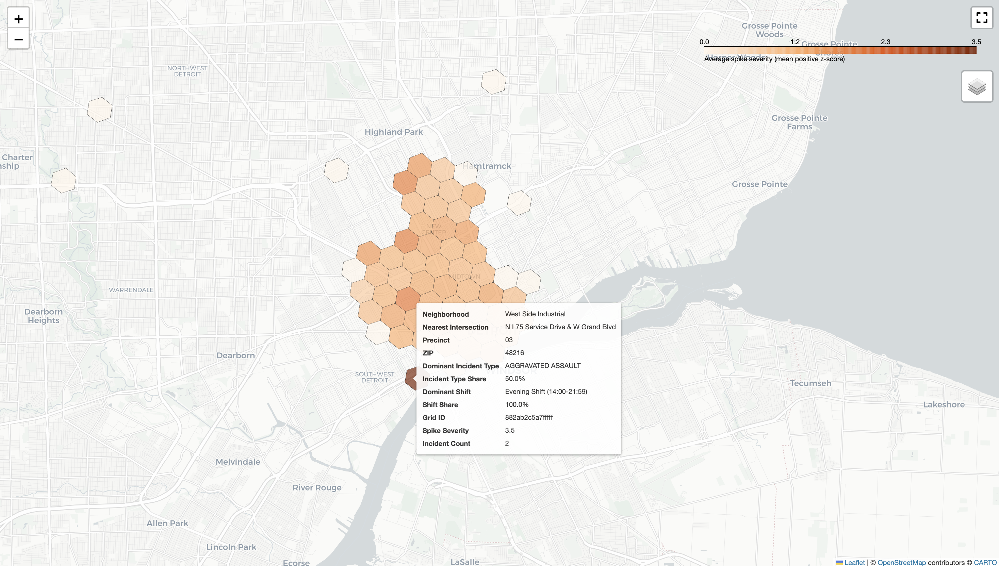
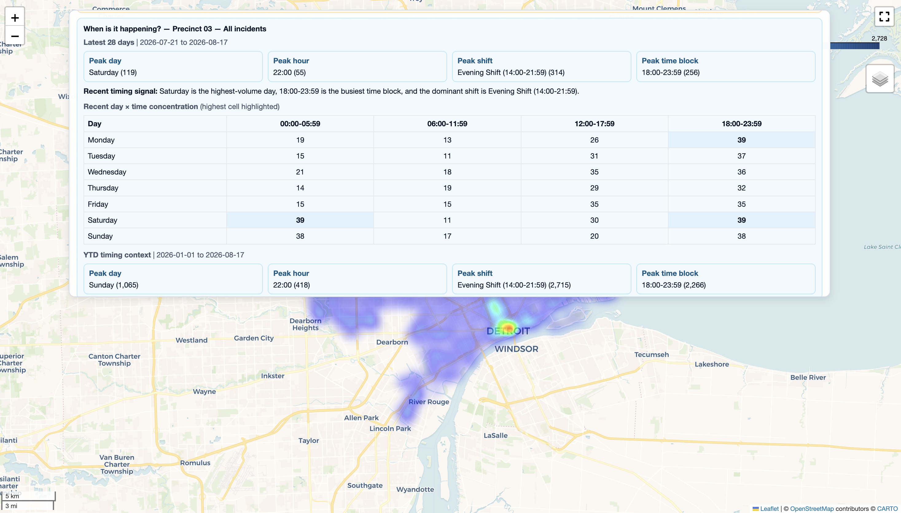
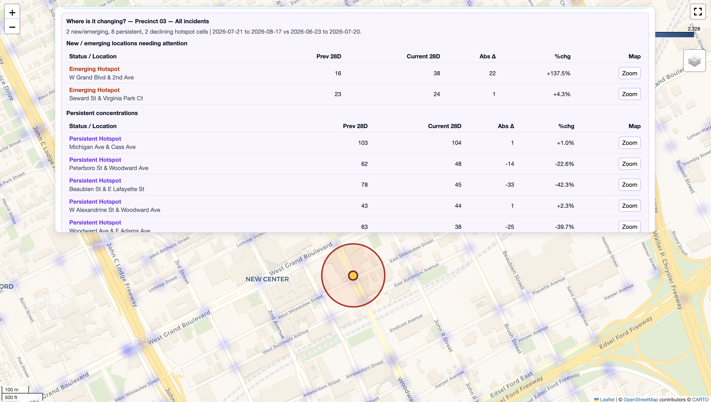
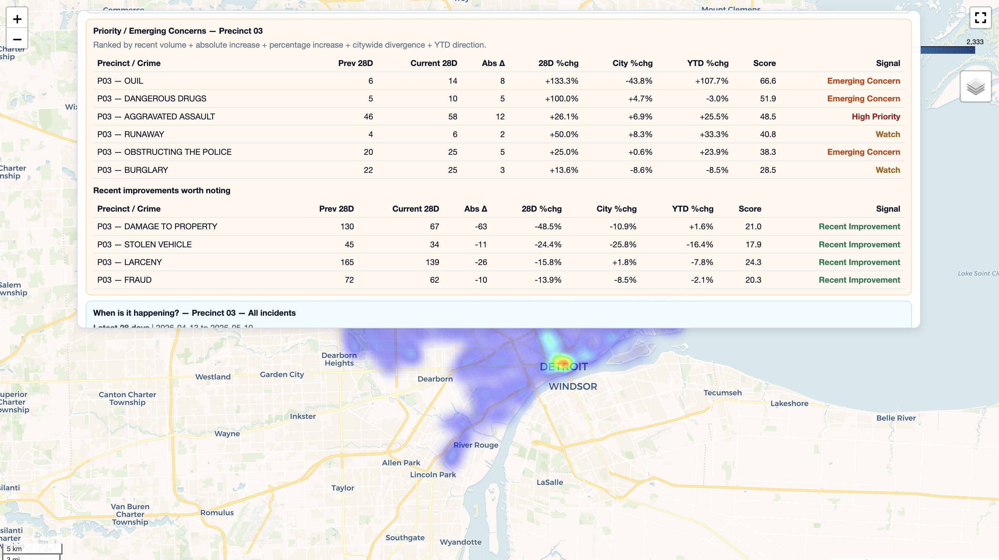

# Detroit Crime Hotspot Analytics

An interactive crime analytics and operational decision-support project examining reported crime patterns across Detroit precincts from **2024–2026**.

### 🔗 Live Dashboard
**[Open Detroit Crime Operations Dashboard](https://greatness522.github.io/Detroit-Crime-Hotspot-Analytics/)**


---

## Project Overview

The Detroit Crime Hotspot Analytics project was developed to explore how reported crime patterns vary across Detroit precincts, locations, crime categories, and time periods.

Rather than relying only on citywide totals, the project uses a **precinct-first analytical framework**. Users begin with the Detroit overview, select an individual precinct, and then drill into the geographic, temporal, and crime-specific patterns affecting that precinct.

The dashboard combines historical comparisons, recent activity, hotspot analysis, spike detection, temporal patterns, and location-level analysis to support a more operational interpretation of crime data.

---

## Analytical Questions

The project was designed to investigate questions such as:

- Which precincts are improving or worsening compared with the previous year?
- Where are incidents geographically concentrated within each precinct?
- Which locations show unusually high or increasing activity?
- Which crime categories are driving changes within a precinct?
- When are incidents occurring by day, hour, and operational shift?
- Are hotspots persistent, emerging, declining, or shifting?
- Which recent patterns may warrant closer operational attention?

---

## Dashboard Workflow

```text
Detroit Overview
        ↓
Select Precinct
        ↓
Precinct Operations Evaluation
        ↓
Location | Crime | Time | Trend
        ↓
Interactive Maps & Analytical Drill-Downs
        ↓
Operational Interpretation
```

The selected precinct becomes the primary analytical context so that subsequent views evaluate the workload and geography associated with that precinct.

---

## Core Analytical Components

### 1. Precinct Performance

Precinct performance is evaluated using matched year-to-date comparisons.

For example, 2026 activity is compared with the equivalent reporting period in 2025 rather than comparing an incomplete year with an entire previous year.

This allows precinct trends to be classified more meaningfully as improving, worsening, or relatively stable.

### 2. Geographic Hotspot Analysis

Interactive maps identify geographic concentrations of reported incidents.

Users can narrow the analysis by precinct and crime category to examine where particular types of activity are concentrated.

Spatial indexing is used to aggregate incidents into comparable geographic cells, allowing concentrations and changes to be evaluated consistently across locations.

### 3. Spike Severity Analysis

The project distinguishes general incident concentration from unusual short-term increases.

This distinction helps separate persistent high-volume areas from locations experiencing a recent abnormal increase, providing a more useful signal for short-term operational review.

### 4. Temporal Analysis

Incident activity is examined across:

- Day of week
- Hour of day
- Operational shift
- Recent 28-day periods
- Monthly patterns

This helps identify when particular crime patterns are most concentrated.

### 5. Hotspot Persistence & Change


Hotspots are evaluated across time to distinguish between locations that remain consistently active and locations whose patterns are changing.

This supports identification of:

- Persistent hotspots
- Emerging locations
- Declining locations
- Shifting concentrations

### 6. Priority & Emerging Concerns


The dashboard identifies offenses requiring attention using recent 28-day
movement, comparison, YTD direction, and priority signals.

Recent activity, historical patterns, crime categories, and geographic signals are combined to identify patterns that may deserve additional review.

These indicators are intended to support investigation and prioritization rather than automatically determine operational action.

---

## Interactive Analysis

The project includes:

- Precinct-level operational evaluation
- Interactive precinct maps
- Focus-location analysis
- Spike severity choropleths
- Crime trend analysis
- Priority and emerging-concern analysis
- Temporal analysis
- Hotspot-change analysis
- Monthly trend heatmaps
- Violent-crime 28-day day/hour analysis
- Shift summaries
- Decision-purpose summaries
- Crime-category filtering
- Geographic drill-downs

---

## Current Citywide Snapshot

Using the matched reporting period currently represented in the dashboard:

- **223,076** total incidents are represented across 2024–2026.
- **51,398** incidents are recorded in the 2026 matched-YTD period.
- 2026 matched-YTD incidents are approximately **4.6% lower than 2025** for the equivalent reporting period.
- Precinct-level trends differ from the overall citywide pattern, making precinct-specific analysis important.

The current matched-YTD reporting window runs through August 17, 2026. The analytical pipeline is designed to refresh the dashboard and derived outputs as newer source data becomes available and the analysis is rerun.

## Project Development

This project was developed end-to-end in Python, combining data preparation, temporal analysis, geospatial analysis, hotspot detection, interactive visualization, and dashboard generation.

The workflow transforms incident-level records into precinct-level operational summaries and interactive analytical outputs. Python is used to clean and structure the data, calculate matched-period comparisons, identify spatial and temporal patterns, generate visualizations, and produce the HTML dashboard and supporting analytical files.

## Technology Stack

**Analysis**
- Python
- Pandas
- NumPy

**Geospatial Analysis**
- Folium
- H3 spatial indexing

**Dashboard**
- HTML
- CSS
- JavaScript

**Development & Deployment**
- Git
- GitHub
- GitHub Pages

---

## Data Coverage

**Location:** Detroit, Michigan  
**Period:** 2024–2026  
**Current matched-YTD endpoint:** August 17, 2026

The project analyzes reported crime incidents across Detroit police precincts using geographic, temporal, categorical, and historical dimensions.

---

## Repository Structure

```text
Detroit-Crime-Hotspot-Analytics/
│
├── Python/
│   └── Analysis and dashboard-generation scripts
│
├── Documentation/
│   └── Analytical outputs and supporting datasets
│
├── Images/
│   ├── Interactive maps
│   ├── Precinct outputs
│   └── Generated visualizations
│
├── index.html
│   └── Main Detroit Crime Operations dashboard
│
└── README.md
    └── Project documentation
```

---

## Analytical Interpretation

This project is designed as a **descriptive and exploratory decision-support tool**.

Hotspots indicate geographic concentrations of reported incidents. Spike indicators identify unusual changes relative to historical or recent patterns. Trend relationships and geographic associations should not, by themselves, be interpreted as evidence that one factor caused another.

The purpose of the analysis is to identify patterns, prioritize areas for further investigation, and make complex crime data easier to interpret operationally.

---

## Author

**Abigail Amofa**  
M.S. Data Science & Business Analytics